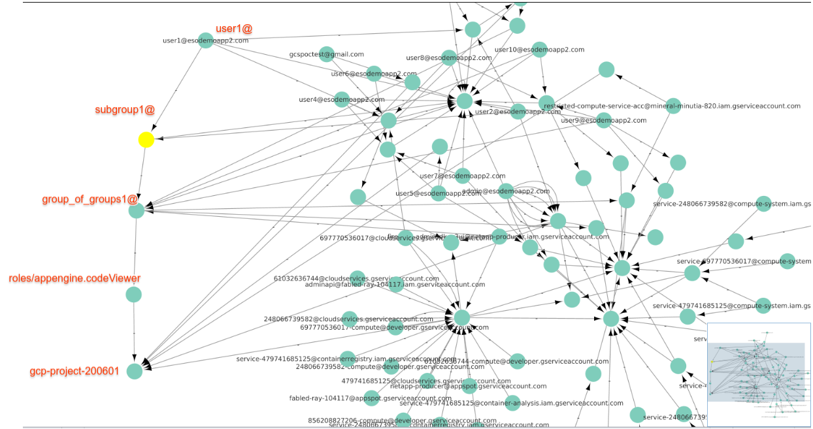
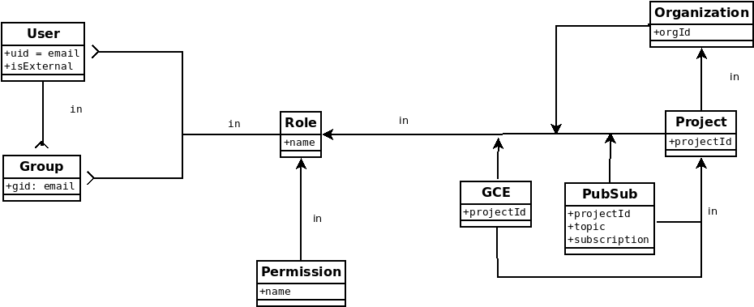
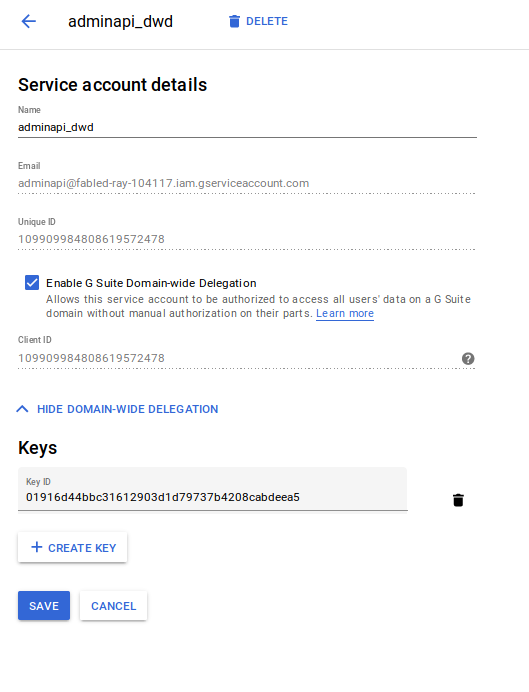
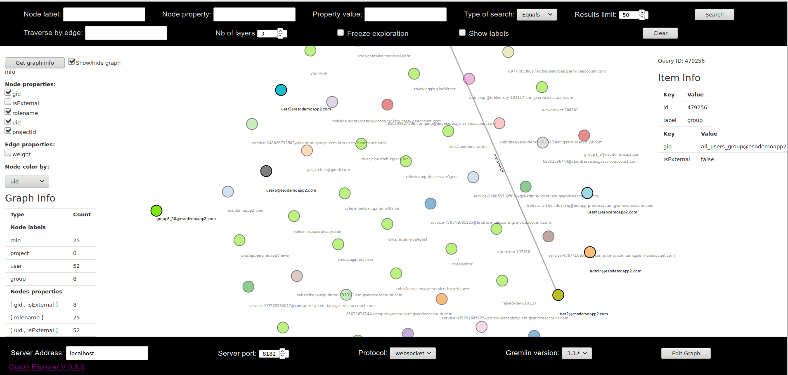
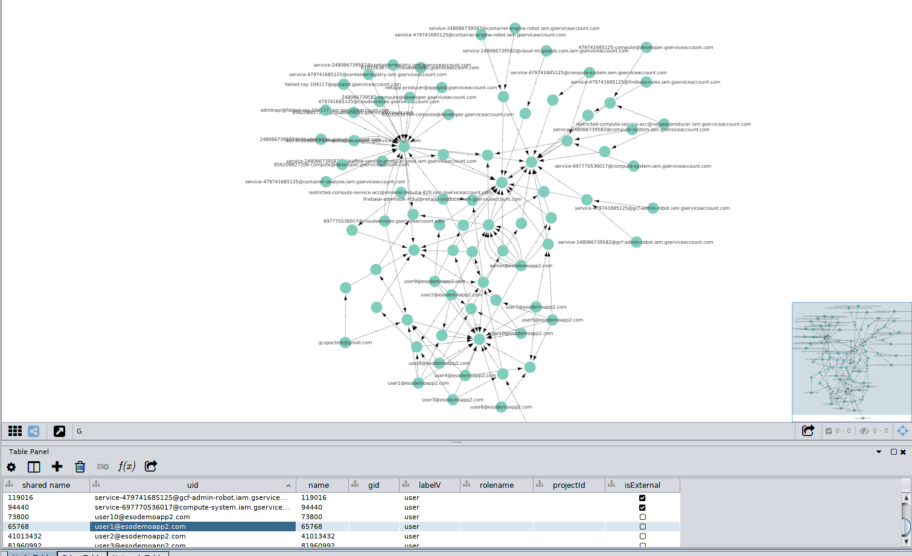

# Representing Gsuites and Google Cloud Org structure as a Graph Database

Sample procedure to import

1. Gsuites Users-Groups
2. Google Cloud IAM Policies (users,Roles,Resource)
3. Google Cloud Projects

into a JanusGraph Database.  

This allows sysadmins to easily 'see' how users, groups are structured across cloud org domain and can surface access privileges not
readily visible (i.e, group of groups, external service accounts).  Visualizing and having nested group structure also allows to easy see
relationships between projects/users/roles/serviceAccounts.

For example, the following trivial section shows how a user has indirect access to a resource via nested groups:


Annotated flow that shows the links

user vertex `user1@`

1. has edge `in` to group vertex `subgroup1@`
   (i.e., user is member of a group)

2. group vertex `subgroup1@` has edge `in` to group vertex `group_of_groups1@`
   (i.e. group of groups)

3. group vertex `group_of_groups1@`  has edge `in` to role vertex `roles/storage.objectViewer`
   (i.e, this role includes a group)  

4. Role vertex `roles/storage.objectViewer`  has edge `in` to resource vertex  `project`
   (i.,e this resource/project has a role assigned to it)

- 

You are free to alter the `vertex->edge->vertex` relationship in anyway you want; i just picked this simple scheme for starters.

SysAdmins can optionally query directly via `gremlin` command line for the same information.


> **WARNING:**  this is just a simple proof of concept: the script attached runs serially and the object hierarchy described below is very basic and likely incorrect!

The intent here is to demonstrate how to load some sample data covering cloud org and gsuites structure into a  graphDB

## Schema

The schema used in this sample is pretty basic and indexes a few properties across users, groups, serviceAccounts project, IAM roles, and resources.

-

> Note: the script and sample below does not cover cloud org, pubsub or GCE resource types.  It only iterates and covers projects

- Users
```python
  g.addV('user').property(label, 'user').property('uid', email).property('isExternal', False).id().next()
```

- Groups
```python
  g.addV('group').property(label, 'group').property('gid', group_email).property('isExternal', False).next()
```

- Projects
```python
  g.addV('project').property(label, 'project').property('projectId', projectId).id().next()
```

- Roles
```python
  g.addV('role').property(label, 'role').property('rolename', name).id().next()  
```


## Setup

The setup steps for this script primarily involves configuring a service account for both domain-wide-delegation and GCP cloud org access.


### Configure Service Account for Domain Wide Delegation

1a. Create Service Account

1b. Enable DWD

- 


1c) Find Oauth2 Client ID:

 ```109909984808619572478```

1d) Set Scopes

- 


### Identify Gsuites CustomerID

You can derive it from your gsuites admin console [here](https://stackoverflow.com/questions/33493998/how-do-i-find-the-immutable-id-of-my-google-apps-account?answertab=votes#tab-top).


In my case its:

```
"customerId": "C023zw3x8"
```


### Configure Service Account for Cloud Org Access


Set cloud ORG policies to apply from the root org node to all resources in the tree:

1e) Org-wide Access:

* Security Reviewer
* Editor


- 


1f) Genrate and download a the service_account key

   - Make sure the project where you are generating the key has the following APIs enabled:
   -  - `directory_v1`,  ```cloudresourcemanager```, `iam`

## Install JanusGraph

- Local
Download and untar [JanusGraph](http://janusgraph.org/)

* Start JanusGraph with defaults (Cassandra, ElasticSearch local)

```bash
$ janusgraph-0.3.0-hadoop2/bin/janusgraph.sh start
Forking Cassandra...
Running `nodetool statusthrift`.. OK (returned exit status 0 and printed string "running").
Forking Elasticsearch...
Connecting to Elasticsearch (127.0.0.1:9200)..... OK (connected to 127.0.0.1:9200).
Forking Gremlin-Server...
Connecting to Gremlin-Server (127.0.0.1:8182)..... OK (connected to 127.0.0.1:8182).
Run gremlin.sh to connect.
```

* Connect via Gremlin

- [gremlin-server](http://tinkerpop.apache.org/docs/current/reference/#gremlin-server)

```bash
$ janusgraph-0.3.0-hadoop2/bin/gremlin.sh

         \,,,/
         (o o)
-----oOOo-(3)-oOOo-----
SLF4J: Class path contains multiple SLF4J bindings.
plugin activated: janusgraph.imports
plugin activated: tinkerpop.server
plugin activated: tinkerpop.gephi
plugin activated: tinkerpop.utilities
gremlin>
```

- Setup Gremlin local connection

```
gremlin> :remote connect tinkerpop.server conf/remote.yaml session
gremlin> :remote console
```

At this point, local scripts on local will get sent to the running gremlin server


## Configure and Run ETL script

First edit [gcp_graph.py][gcp_graph.py] and set:

- customer_id
- domain_name

Then make sure Janusgraph and gremlin are both running before running the script.

if its all configured, you should see an output like the one shown below.  Note, the script runs ``sequentially!!!``.  It will take a long time and is an **inconsistent snapshot**


## References

- [https://docs.janusgraph.org/latest/getting-started.html](https://docs.janusgraph.org/latest/getting-started.html)
- [gremlin-server](http://tinkerpop.apache.org/docs/current/reference/#gremlin-server)
- [https://github.com/bricaud/graphexp](https://github.com/bricaud/graphexp)
- [https://medium.com/@BGuigal/janusgraph-python-9e8d6988c36c](https://medium.com/@BGuigal/janusgraph-python-9e8d6988c36c)
- [https://github.com/apache/tinkerpop/tree/master/gremlin-python/](https://github.com/apache/tinkerpop/tree/master/gremlin-python/)
- [https://www.compose.com/articles/graph-101-traversing-and-querying-janusgraph-using-gremlin/](https://www.compose.com/articles/graph-101-traversing-and-querying-janusgraph-using-gremlin/)

### Gremlin References

#### Drop All Verticies and Edges

- On Gremlin Console
```bash
g.V().drop()
g.E().drop()
```

For gremlin-python, simply append suffix commands to submit the request to Gremlin-Server, eg: ```.next()```, ```.iterate()```:

```bash
g.V().drop().iterate()
g.E().drop().iterate()
```

Sample query to retrieve a user and its edges:

* VertexID for a user:
```bash
gremlin> u1 = g.V().has("uid", "user1@esodemoapp2.com")
==>v[2842792]
```

* Outbound Edges from a Vertex:
```
gremlin> g.V().hasLabel('user').has('uid', 'user1@esodemoapp2.com').outE()
==>e[zy8l-1oxig-3yt-1p3u0][2842792-memberOf->2850984]
==>e[101ed-1oxig-3yt-1p6zs][2842792-memberOf->2855080]
==>e[1045x-1oxig-3yt-53ea8][2842792-memberOf->8556560]
==>e[zymt-1oxig-3yt-rwrvc][2842792-memberOf->46878744]

gremlin> g.V().hasLabel('user').has('uid', 'user1@esodemoapp2.com').out().valueMap()
==>{gid=[all_users_group@esodemoapp2.com], isExternal=[false]}
==>{gid=[group_external_mixed1@esodemoapp2.com], isExternal=[false]}
==>{gid=[subgroup1@esodemoapp2.com], isExternal=[false]}
==>{gid=[group1_3@esodemoapp2.com], isExternal=[false]}
```


### Janus Schema Index

If you need ot setup an Index on Janusgraph to speed up large graph traversal, the following setups a sample composite index:

Via gremlin-console:

```bash
:remote connect tinkerpop.server conf/remote.yaml session
:remote console

mgmt = graph.openManagement()
user = mgmt.makeVertexLabel('user').make()
group = mgmt.makeVertexLabel('group').make()

uid = mgmt.makePropertyKey('uid').dataType(String.class).cardinality(org.janusgraph.core.Cardinality.SINGLE).make()
gid = mgmt.makePropertyKey('gid').dataType(String.class).cardinality(org.janusgraph.core.Cardinality.SINGLE).make()
memberOf = mgmt.makeEdgeLabel('memberOf').multiplicity(MULTI).make()
mgmt.commit()

mgmt = graph.openManagement()
uid = mgmt.getPropertyKey('uid')
mgmt.buildIndex("uidIndex", Vertex.class).addKey(uid).buildCompositeIndex()
mgmt.commit();

ManagementSystem.awaitGraphIndexStatus(graph, "uidIndex").status(SchemaStatus.REGISTERED).call();
mgmt = graph.openManagement();
index = mgmt.getGraphIndex("uidIndex");
mgmt.updateIndex(index, SchemaAction.REINDEX);
mgmt.commit();

mgmt = graph.openManagement()
uid = mgmt.getPropertyKey('uid')
user = mgmt.getVertexLabel('user')
mgmt.buildIndex('byUidAndLabel', Vertex.class).addKey(uid).indexOnly(user).buildCompositeIndex()
mgmt.commit()

ManagementSystem.awaitGraphIndexStatus(graph, 'byUidAndLabel').call()
mgmt = graph.openManagement()
mgmt.updateIndex(mgmt.getGraphIndex("byUidAndLabel"), SchemaAction.REINDEX).get()
mgmt.commit()
```


### Visualizing the Graph

There are several ways to visualize the generated graph:


#### graphexp

```
git clone https://github.com/bricaud/graphexp.git

cd graphexp
firefox index.html
```

- 


#### Cytoscape

- Export graph to GraphML file:
```
gremlin> sg = g.V().outE().subgraph('sg').cap('sg').next()
==>tinkergraph[vertices:81 edges:140]

gremlin> sg.io(IoCore.graphml()).writeGraph("/tmp/mygraph.xml")
==>null
gremlin> 
```

- Import GraphML to Cytoscape

on Cytoscape, ```File->Import->Network->File```,  Select ```GraphMLFile```  the ```/tmp/mygraph.xml```

Upon import you should see the Cytosscape rendering:

- 


### Gephi

Export to Gephi for Streaming

```bash
gremlin> :remote connect tinkerpop.gephi
==>Connection to Gephi - http://localhost:8080/workspace1 with stepDelay:1000, startRGBColor:[0.0, 1.0, 0.5], colorToFade:g, colorFadeRate:0.7, startSize:10.0,sizeDecrementRate:0.33

gremlin> :remote list
==>0 - Gremlin Server - [localhost/127.0.0.1:8182]-[1f4452c0-4580-4ecf-9648-bc668c4ee68e]
==>*1 - Gephi - [workspace1]
```


## Admin API


The following is just a sampl raw JSON snippet for the various API calls made to ```directory_service```, ```IAM``` and ```Cloud Resource Manager```.


- https://cloud.google.com/resource-manager/reference/rest/
- https://cloud.google.com/iam/reference/rest/v1/projects.roles/list
- https://developers.google.com/admin-sdk/directory/v1/guides/authorizing


### User
```json
{
    "agreedToTerms": true,
    "archived": false,
    "changePasswordAtNextLogin": false,
    "creationTime": "2017-03-03T23:08:45.000Z",
    "customerId": "C023zw3x8",
    "emails": [
        {
            "address": "user1@esodemoapp2.com",
            "primary": true
        }
    ],
    "etag": "\"TN30oD80QTVK45AAxvl_wbzs4vs/BAzqYm49odJENQxY5BR65PFiveU\"",
    "id": "104497032270219758212",
    "includeInGlobalAddressList": true,
    "ipWhitelisted": false,
    "isAdmin": false,
    "isDelegatedAdmin": false,
    "isEnforcedIn2Sv": false,
    "isEnrolledIn2Sv": false,
    "isMailboxSetup": true,
    "kind": "admin#directory#user",
    "lastLoginTime": "2018-08-08T00:12:15.000Z",
    "name": {
        "familyName": "user1",
        "fullName": "user1 user1",
        "givenName": "user1"
    },
    "nonEditableAliases": [
        "user1@esodemoapp2.com.test-google-a.com"
    ],
    "orgUnitPath": "/",
    "primaryEmail": "user1@esodemoapp2.com",
    "suspended": false
}
```

### Group

```json
        {
            "adminCreated": true,
            "description": "",
            "directMembersCount": "2",
            "email": "group3@esodemoapp2.com",
            "etag": "\"TN30oD80QTVK45AAxvl_wbzs4vs/X-IafYaBZOxR2IyF9AlAQ_T_rrs\"",
            "id": "00haapch343tg2v",
            "kind": "admin#directory#group",
            "name": "group3",
            "nonEditableAliases": [
                "group3@esodemoapp2.com.test-google-a.com"
            ]
        }
```


## IAM

### projcts

```json
        {
            "createTime": "2015-09-16T20:02:53.933Z",
            "lifecycleState": "ACTIVE",
            "name": "user2project2",
            "parent": {
                "id": "827482733258",
                "type": "folder"
            },
            "projectId": "user2project2",
            "projectNumber": "856208827206"
        },
        {
            "createTime": "2015-08-18T17:36:38.118Z",
            "lifecycleState": "ACTIVE",
            "name": "project1",
            "parent": {
                "id": "673208786098",
                "type": "organization"
            },
            "projectId": "fabled-ray-104117",
            "projectNumber": "248066739582"
        }

```
### IAM Bindings
```json
{
    "bindings": [
        {
            "members": [
                "serviceAccount:856208827206-compute@developer.gserviceaccount.com",
                "serviceAccount:856208827206@cloudservices.gserviceaccount.com",
                "serviceAccount:user2project2@appspot.gserviceaccount.com"
            ],
            "role": "roles/editor"
        },
        {
            "members": [
                "user:admin@esodemoapp2.com",
                "user:user2@esodemoapp2.com"
            ],
            "role": "roles/owner"
        }
    ],
    "etag": "BwVscizSf/Q=",
    "version": 1
}

```

### ServiceAccounts

```json
    "accounts": [
        {
            "displayName": "Compute Engine default service account",
            "email": "697770536017-compute@developer.gserviceaccount.com",
            "etag": "BwVpYHX+Ecs=",
            "name": "projects/your-vpn/serviceAccounts/697770536017-compute@developer.gserviceaccount.com",
            "oauth2ClientId": "111081231294235977990",
            "projectId": "your-vpn",
            "uniqueId": "111081231294235977990"
        }
    ]
```
### Roles

- 

```json
{
    "roles": [
        {
            "description": "Created on: 2018-08-13",
            "etag": "BwVzUMHQb3g=",
            "name": "projects/fabled-ray-104117/roles/CustomRole",
            "title": "Custom Role1"
        }
    ]
}
```

### Sample output

```bash
======================= Users
  admin@esodemoapp2.com
  user10@esodemoapp2.com
  user1@esodemoapp2.com
  user2@esodemoapp2.com
  user3@esodemoapp2.com
  user4@esodemoapp2.com
  user5@esodemoapp2.com
  user6@esodemoapp2.com
  user7@esodemoapp2.com
  user8@esodemoapp2.com
  user9@esodemoapp2.com
======================= Groups
  all_users_group@esodemoapp2.com
  group1_3@esodemoapp2.com
  group4_7@esodemoapp2.com
  group8_10@esodemoapp2.com
  group_external_mixed1@esodemoapp2.com
  group_of_groups_1@esodemoapp2.com
  subgroup1@esodemoapp2.com
  subgroup2@esodemoapp2.com
======================= Group Members for group: all_users_group@esodemoapp2.com
     GroupID: C023zw3x8 Type: CUSTOMER
     Adding ALL Users  --in--> all_users_group@esodemoapp2.com
======================= Group Members for group: group1_3@esodemoapp2.com
     Adding user1@esodemoapp2.com --in--> group1_3@esodemoapp2.com
     Adding user2@esodemoapp2.com --in--> group1_3@esodemoapp2.com
     Adding user3@esodemoapp2.com --in--> group1_3@esodemoapp2.com
======================= Group Members for group: group4_7@esodemoapp2.com
     Adding user4@esodemoapp2.com --in--> group4_7@esodemoapp2.com
     Adding user5@esodemoapp2.com --in--> group4_7@esodemoapp2.com
     Adding user6@esodemoapp2.com --in--> group4_7@esodemoapp2.com
     Adding user7@esodemoapp2.com --in--> group4_7@esodemoapp2.com
======================= Group Members for group: group8_10@esodemoapp2.com
     Adding user10@esodemoapp2.com --in--> group8_10@esodemoapp2.com
     Adding user8@esodemoapp2.com --in--> group8_10@esodemoapp2.com
     Adding user9@esodemoapp2.com --in--> group8_10@esodemoapp2.com
======================= Group Members for group: group_external_mixed1@esodemoapp2.com
     Adding 697770536017@cloudservices.gserviceaccount.com --in--> group_external_mixed1@esodemoapp2.com
     Adding gcspoctest@gmail.com --in--> group_external_mixed1@esodemoapp2.com
     Adding user1@esodemoapp2.com --in--> group_external_mixed1@esodemoapp2.com
     Adding user4@esodemoapp2.com --in--> group_external_mixed1@esodemoapp2.com
     Adding user8@esodemoapp2.com --in--> group_external_mixed1@esodemoapp2.com
======================= Group Members for group: group_of_groups_1@esodemoapp2.com
     Adding firebase-adminsdk-rr3uj@netapp-producer.iam.gserviceaccount.com --in--> group_of_groups_1@esodemoapp2.com
     GroupID: 04bvk7pj2tzqm85 GroupEmail: subgroup1@esodemoapp2.com Type: GROUP
     Adding subgroup1@esodemoapp2.com --in--> group_of_groups_1@esodemoapp2.com
     >>> Recursion on subgroup1@esodemoapp2.com
======================= Group Members for group: subgroup1@esodemoapp2.com
     Adding user1@esodemoapp2.com --in--> subgroup1@esodemoapp2.com
     Adding user2@esodemoapp2.com --in--> subgroup1@esodemoapp2.com
     GroupID: 01baon6m0tnp44o GroupEmail: subgroup2@esodemoapp2.com Type: GROUP
     Adding subgroup2@esodemoapp2.com --in--> group_of_groups_1@esodemoapp2.com
     >>> Recursion on subgroup2@esodemoapp2.com
======================= Group Members for group: subgroup2@esodemoapp2.com
     Adding salmaan@43eskaton.com --in--> subgroup2@esodemoapp2.com
     Adding user3@esodemoapp2.com --in--> subgroup2@esodemoapp2.com
     Adding user10@esodemoapp2.com --in--> group_of_groups_1@esodemoapp2.com
     Adding user9@esodemoapp2.com --in--> group_of_groups_1@esodemoapp2.com
======================= Group Members for group: subgroup1@esodemoapp2.com
======================= Group Members for group: subgroup2@esodemoapp2.com
======================= Get Projects
======================= ServiceAccounts for project your-vpn
     Adding ServiceAccount 697770536017-compute@developer.gserviceaccount.com
======================= CustomRoles for project your-vpn
======================= Iam Policy for project your-vpn
     Adding roles/compute.serviceAgent --in--> your-vpn
     Adding service-697770536017@compute-system.iam.gserviceaccount.com --in--> roles/compute.serviceAgent
     Adding roles/editor --in--> your-vpn
     Adding 697770536017-compute@developer.gserviceaccount.com --in--> roles/editor
     Adding 697770536017@cloudservices.gserviceaccount.com --in--> roles/editor
     Adding 697770536017-compute@developer.gserviceaccount.com --in--> roles/editor
     Adding 697770536017@cloudservices.gserviceaccount.com --in--> roles/editor
     Adding roles/owner --in--> your-vpn
     Adding admin@esodemoapp2.com --in--> roles/owner
======================= ServiceAccounts for project gcp-project-200601
     Adding ServiceAccount 61032636744-compute@developer.gserviceaccount.com
======================= CustomRoles for project gcp-project-200601
======================= Iam Policy for project gcp-project-200601
     Adding roles/appengine.codeViewer --in--> gcp-project-200601
     Adding group_of_groups_1@esodemoapp2.com --in--> roles/appengine.codeViewer
     Adding roles/editor --in--> gcp-project-200601
     Adding 61032636744-compute@developer.gserviceaccount.com --in--> roles/editor
     Adding 61032636744@cloudservices.gserviceaccount.com --in--> roles/editor
     Adding roles/endpoints.portalAdmin --in--> gcp-project-200601
     Adding restricted-compute-service-acc@mineral-minutia-820.iam.gserviceaccount.com --in--> roles/endpoints.portalAdmin
     Adding roles/genomics.viewer --in--> gcp-project-200601
     Adding user5@esodemoapp2.com --in--> roles/genomics.viewer
     Adding roles/owner --in--> gcp-project-200601
     Adding admin@esodemoapp2.com --in--> roles/owner
     Adding roles/serviceusage.serviceUsageViewer --in--> gcp-project-200601
     Adding group1_3@esodemoapp2.com --in--> roles/serviceusage.serviceUsageViewer
     Adding roles/viewer --in--> gcp-project-200601
     Adding gcspoctest@gmail.com --in--> roles/viewer
======================= ServiceAccounts for project esp-demo-197318
     Adding ServiceAccount publisher@esp-demo-197318.iam.gserviceaccount.com
     Adding ServiceAccount subscriber@esp-demo-197318.iam.gserviceaccount.com
======================= CustomRoles for project esp-demo-197318
======================= Iam Policy for project esp-demo-197318
     Adding roles/owner --in--> esp-demo-197318
     Adding admin@esodemoapp2.com --in--> roles/owner
======================= ServiceAccounts for project netapp-producer
     Adding ServiceAccount netapp-producer@appspot.gserviceaccount.com
     Adding ServiceAccount good-robot@netapp-producer.iam.gserviceaccount.com
     Adding ServiceAccount metrics-robot@netapp-producer.iam.gserviceaccount.com
     Adding ServiceAccount restricted-compute-service-acc@netapp-producer.iam.gserviceaccount.com
     Adding ServiceAccount 479741685125-compute@developer.gserviceaccount.com
======================= CustomRoles for project netapp-producer
======================= Iam Policy for project netapp-producer
     Adding roles/appengine.appViewer --in--> netapp-producer
     Adding group_of_groups_1@esodemoapp2.com --in--> roles/appengine.appViewer
     Adding roles/bigquery.user --in--> netapp-producer
     Adding user5@esodemoapp2.com --in--> roles/bigquery.user
     Adding roles/cloudfunctions.serviceAgent --in--> netapp-producer
     Adding service-479741685125@gcf-admin-robot.iam.gserviceaccount.com --in--> roles/cloudfunctions.serviceAgent
     Adding roles/compute.serviceAgent --in--> netapp-producer
     Adding service-479741685125@compute-system.iam.gserviceaccount.com --in--> roles/compute.serviceAgent
     Adding roles/container.admin --in--> netapp-producer
     Adding service-479741685125@compute-system.iam.gserviceaccount.com --in--> roles/container.admin
     Adding roles/container.serviceAgent --in--> netapp-producer
     Adding service-479741685125@container-engine-robot.iam.gserviceaccount.com --in--> roles/container.serviceAgent
     Adding roles/editor --in--> netapp-producer
     Adding 479741685125@cloudservices.gserviceaccount.com --in--> roles/editor
     Adding firebase-adminsdk-rr3uj@netapp-producer.iam.gserviceaccount.com --in--> roles/editor
     Adding netapp-producer@appspot.gserviceaccount.com --in--> roles/editor
     Adding service-479741685125@container-analysis.iam.gserviceaccount.com --in--> roles/editor
     Adding service-479741685125@containerregistry.iam.gserviceaccount.com --in--> roles/editor
     Adding roles/firebaserules.system --in--> netapp-producer
     Adding service-479741685125@firebase-rules.iam.gserviceaccount.com --in--> roles/firebaserules.system
     Adding roles/iap.httpsResourceAccessor --in--> netapp-producer
     Adding admin@esodemoapp2.com --in--> roles/iap.httpsResourceAccessor
     Adding roles/logging.logWriter --in--> netapp-producer
     Adding 479741685125-compute@developer.gserviceaccount.com --in--> roles/logging.logWriter
     Adding restricted-compute-service-acc@netapp-producer.iam.gserviceaccount.com --in--> roles/logging.logWriter
     Adding roles/monitoring.metricWriter --in--> netapp-producer
     Adding restricted-compute-service-acc@netapp-producer.iam.gserviceaccount.com --in--> roles/monitoring.metricWriter
     Adding roles/owner --in--> netapp-producer
     Adding admin@esodemoapp2.com --in--> roles/owner
     Adding roles/storage.objectViewer --in--> netapp-producer
     Adding group_of_groups_1@esodemoapp2.com --in--> roles/storage.objectViewer
======================= ServiceAccounts for project user2project2
     Adding ServiceAccount user2project2@appspot.gserviceaccount.com
     Adding ServiceAccount 856208827206-compute@developer.gserviceaccount.com
======================= CustomRoles for project user2project2
======================= Iam Policy for project user2project2
     Adding roles/clouddebugger.user --in--> user2project2
     Adding group_external_mixed1@esodemoapp2.com --in--> roles/clouddebugger.user
     Adding roles/editor --in--> user2project2
     Adding 856208827206-compute@developer.gserviceaccount.com --in--> roles/editor
     Adding 856208827206@cloudservices.gserviceaccount.com --in--> roles/editor
     Adding roles/owner --in--> user2project2
     Adding admin@esodemoapp2.com --in--> roles/owner
     Adding user2@esodemoapp2.com --in--> roles/owner
======================= ServiceAccounts for project fabled-ray-104117
     Adding ServiceAccount adminapi@fabled-ray-104117.iam.gserviceaccount.com
     Adding ServiceAccount fabled-ray-104117@appspot.gserviceaccount.com
     Adding ServiceAccount 248066739582-compute@developer.gserviceaccount.com
======================= CustomRoles for project fabled-ray-104117
     projects/fabled-ray-104117/roles/CustomRole
======================= Iam Policy for project fabled-ray-104117
     Adding projects/fabled-ray-104117/roles/CustomRole --in--> fabled-ray-104117
     Adding user9@esodemoapp2.com --in--> projects/fabled-ray-104117/roles/CustomRole
     Adding roles/appengine.appViewer --in--> fabled-ray-104117
     Adding restricted-compute-service-acc@mineral-minutia-820.iam.gserviceaccount.com --in--> roles/appengine.appViewer
     Adding roles/bigquery.user --in--> fabled-ray-104117
     Adding user7@esodemoapp2.com --in--> roles/bigquery.user
     Adding roles/cloudfunctions.serviceAgent --in--> fabled-ray-104117
     Adding service-248066739582@gcf-admin-robot.iam.gserviceaccount.com --in--> roles/cloudfunctions.serviceAgent
     Adding roles/cloudprofiler.user --in--> fabled-ray-104117
     Adding user9@esodemoapp2.com --in--> roles/cloudprofiler.user
     Adding roles/cloudtrace.user --in--> fabled-ray-104117
     Adding group8_10@esodemoapp2.com --in--> roles/cloudtrace.user
     Adding roles/compute.imageUser --in--> fabled-ray-104117
     Adding esodemoapp2.com --in--> roles/compute.imageUser
     Adding roles/compute.serviceAgent --in--> fabled-ray-104117
     Adding service-248066739582@compute-system.iam.gserviceaccount.com --in--> roles/compute.serviceAgent
     Adding roles/container.serviceAgent --in--> fabled-ray-104117
     Adding service-248066739582@container-engine-robot.iam.gserviceaccount.com --in--> roles/container.serviceAgent
     Adding roles/dataflow.serviceAgent --in--> fabled-ray-104117
     Adding service-248066739582@dataflow-service-producer-prod.iam.gserviceaccount.com --in--> roles/dataflow.serviceAgent
     Adding roles/editor --in--> fabled-ray-104117
     Adding 248066739582-compute@developer.gserviceaccount.com --in--> roles/editor
     Adding 248066739582@cloudservices.gserviceaccount.com --in--> roles/editor
     Adding adminapi@fabled-ray-104117.iam.gserviceaccount.com --in--> roles/editor
     Adding fabled-ray-104117@appspot.gserviceaccount.com --in--> roles/editor
     Adding service-248066739582@containerregistry.iam.gserviceaccount.com --in--> roles/editor
     Adding roles/iap.httpsResourceAccessor --in--> fabled-ray-104117
     Adding admin@esodemoapp2.com --in--> roles/iap.httpsResourceAccessor
     Adding roles/ml.serviceAgent --in--> fabled-ray-104117
     Adding service-248066739582@cloud-ml.google.com.iam.gserviceaccount.com --in--> roles/ml.serviceAgent
     Adding roles/owner --in--> fabled-ray-104117
     Adding admin@esodemoapp2.com --in--> roles/owner
```
