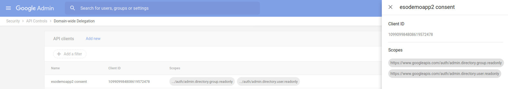
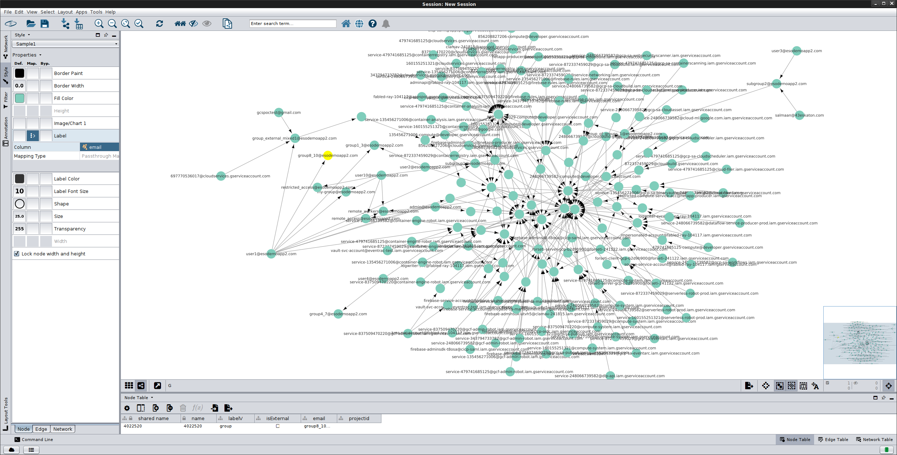

# Representing Gsuites and Google Cloud Org structure as a Graph Database

Sample procedure to import

1. Gsuites Users-Groups
2. Google Cloud IAM Policies (users,Roles,Resource)
3. Google Cloud Projects

into a JanusGraph Database.  

This allows sysadmins to easily 'see' how users, groups are structured across cloud org domain and can surface access privileges not
readily visible (i.e, group of groups, external service accounts).  Visualizing and having nested group structure also allows to easy see
relationships between projects/users/roles/serviceAccounts.

For example, the following trivial section shows how a user has indirect access to a resource via nested groups:


Annotated flow that shows the links

user vertex `user1@`

1. has edge `in` to group vertex `subgroup1@`
   (i.e., user is member of a group)

2. group vertex `subgroup1@` has edge `in` to group vertex `group_of_groups1@`
   (i.e. group of groups)

3. group vertex `group_of_groups1@`  has edge `in` to role vertex `roles/appengine.codeViewer`
   (i.e, this role includes a group)  

4. Role vertex `roles/appengine.codeViewer`  has edge `in` to resource vertex  `gcp-project-200601`
   (i.,e this resource/project has a role assigned to it)

5. Adding IAM Permissions to Role Vertices
   
   It would be useful to add the IAM permissions as multi-valued properties to each "Role" node
   However, as of `2/5/21`, there are some issues i've come across in doing this that i've detailed at the end of the doc.


- 

You are free to alter the `vertex->edge->vertex` relationship in anyway you want; i just picked this simple scheme for starters.

SysAdmins can optionally query directly via `gremlin` command line for the same information.


> **WARNING:**  this is just a simple proof of concept: the script attached runs serially and the object hierarchy described below is very basic and likely incorrect!

The intent here is to demonstrate how to load some sample data covering cloud org and gsuites structure into a  graphDB

## Schema

The schema used in this sample is pretty basic and indexes a few properties across users, groups, serviceAccounts project, IAM roles, and resources.  However, there is boilerplate snippet that demonstrates iterating other resource types.   For reference, see `func getGCS(ctx context.Context)`

The code snippet contained there iterates projects and for each bucket in that project, extracts the IAM bindings and members.  The idea is to use that info to generate groovy snippets to emit to a file.

-

> Note: the script and sample below does not cover cloud org, pubsub or GCE resource types.  It only iterates and covers projects

- Users
```python
  g.addV('user').property(label, 'user').property('email', email).id().next()
```

- ServiceAccount
```python
  g.addV('serviceAccount').property(label, 'serviceAccount').property('email', email).id().next()
```

- Groups
```python
  g.addV('group').property(label, 'group').property('email', group_email).next()
```

- Projects
```python
  g.addV('project').property(label, 'project').property('projectId', projectId).id().next()
```

- Roles
```python
  g.addV('role').property(label, 'role').property('rolename', name).id().next()  
```


## Setup

The setup steps for this script primarily involves configuring a service account for both domain-wide-delegation and GCP cloud org access.


### Configure Service Account for Domain Wide Delegation

1a. Create Service Account

1b. Enable DWD

- 


1c) Find Oauth2 Client ID:

 ```109909984808619572478```

1d) Set Scopes

- 

```golang
	// View users on your domain
	AdminDirectoryUserReadonlyScope = "https://www.googleapis.com/auth/admin.directory.user.readonly"
	// View groups on your domain
	AdminDirectoryGroupReadonlyScope = "https://www.googleapis.com/auth/admin.directory.group.readonly"
```

For a list of scopes, see [Admin Directory API](`https://developers.google.com/identity/protocols/oauth2/scopes#admin-directory`)

### Identify Gsuites CustomerID

You can derive it from your gsuites admin console [here](https://stackoverflow.com/questions/33493998/how-do-i-find-the-immutable-id-of-my-google-apps-account?answertab=votes#tab-top).


In my case its:

```
"customerId": "C023zw3x8"
```

alternatively,

```
$ gcloud organizations list
DISPLAY_NAME               ID  DIRECTORY_CUSTOMER_ID
esodemoapp2.com  673208786098              C023zw3x8

```

### Configure Service Account for Cloud Org Access


Set cloud ORG policies to apply from the root org node to all resources in the tree:

1e) Org-wide Access:

* Security Reviewer
* Editor


- 


1f) Generate and download a the service_account key

   - Make sure the project where you are generating the key has the following APIs enabled:

*  [directory_v1](https://godoc.org/google.golang.org/api/admin/directory/v1)
*  [iam](https://godoc.org/google.golang.org/api/iam/v1)
*  [cloudresourcemanager](https://godoc.org/google.golang.org/api/cloudresourcemanager/v1beta1)

## Install JanusGraph

- Local
Download and untar [JanusGraph](http://janusgraph.org/).  I used version [janusgraph-0.3.0-hadoop2](https://github.com/JanusGraph/janusgraph/releases/tag/v0.3.0)

* Start JanusGraph with defaults (Cassandra, ElasticSearch local)  
  Note, you need [java8](https://docs.janusgraph.org/getting-started/installation/#local-installation)

```bash
export JAVA_HOME=/path/to/jre1.8.0_211/

$ janusgraph-0.3.0-hadoop2/bin/janusgraph.sh start
Forking Cassandra...
Running `nodetool statusthrift`.. OK (returned exit status 0 and printed string "running").
Forking Elasticsearch...
Connecting to Elasticsearch (127.0.0.1:9200)..... OK (connected to 127.0.0.1:9200).
Forking Gremlin-Server...
Connecting to Gremlin-Server (127.0.0.1:8182)..... OK (connected to 127.0.0.1:8182).
Run gremlin.sh to connect.
```

* Connect via Gremlin

- [gremlin-server](http://tinkerpop.apache.org/docs/current/reference/#gremlin-server)

```bash
$ janusgraph-0.3.0-hadoop2/bin/gremlin.sh

         \,,,/
         (o o)
-----oOOo-(3)-oOOo-----
SLF4J: Class path contains multiple SLF4J bindings.
plugin activated: janusgraph.imports
plugin activated: tinkerpop.server
plugin activated: tinkerpop.gephi
plugin activated: tinkerpop.utilities
gremlin>
```

- Setup Gremlin local connection

```
:remote connect tinkerpop.server conf/remote.yaml session
:remote console
```

At this point, local scripts on local will get sent to the running gremlin server


## Configure and Run ETL script


- `serviceAccountFile`: path to the service account file
- `subject`:  the email/identity of a gsuites domain admin to represent
- `cx`: Gsuites customerID

then on a system with `go 1.11`, run

```
go run main.go \
  --serviceAccountFile=/path/to/svc_account.json \
  --subject=admin@esodemoapp2.com \
  --component=all \
  --cx=C023zw3x8 \
  --logtostderr=1 -v 20
```

>>  NOTE: this utility will only sync ACTIVE projects

The parameters will iterate through all the gsuites user,groups as well as the projects and IAM memberships.

If you want to see more details, you can use log level `4` as shown here:

```
 go run main.go --logtostderr=1 -v 4
```

(full `groovy` text output to stdout, use level `10`)

If you want to iterate only a subcomponent, use the `--component` flag.   For example, if you just want to iterate users, run

```
 go run main.go --logtostderr=1 -v 4 --component users
```


The output of this run will generate several raw groovy files:

- `users.groovy`:  users to add to the map
- `groups.groovy`:  groups and groupmembers to add
- `projects.groovy`:  list of the projects to add to the graph
- `roles.groovy`:  Custom and possibly generic roles to add
- `serviceaccounts.groovy`:  list of the service ac
- `iam.groovy`:  IAM policy maps.


Note, `init.groovy` generates the index and properties (used primarily to add permissions to roles):

```groovy
mgmt = graph.openManagement()
p = mgmt.getPropertyKey("permissions")
if (p == null) {
    mgmt.makePropertyKey('permissions').dataType(String.class).cardinality(org.janusgraph.core.Cardinality.LIST).make()
    mgmt.commit()
}
```

Combine all the files:

```bash
cat init.groovy users.groovy serviceaccounts.groovy groups.groovy projects.groovy iam.groovy roles.groovy > all.groovy
```

Then make sure Janusgraph and gremlin are both running before loading each file.

in the gremlin console, run

```
gremlin> :load  /path/to/all.groovy
```

if its all configured, you should see an output displaying the vertices and edges that were created.


## References

- [https://docs.janusgraph.org/latest/getting-started.html](https://docs.janusgraph.org/latest/getting-started.html)
- [gremlin-server](http://tinkerpop.apache.org/docs/current/reference/#gremlin-server)
- [https://github.com/bricaud/graphexp](https://github.com/bricaud/graphexp)
- [https://medium.com/@BGuigal/janusgraph-python-9e8d6988c36c](https://medium.com/@BGuigal/janusgraph-python-9e8d6988c36c)
- [https://github.com/apache/tinkerpop/tree/master/gremlin-python/](https://github.com/apache/tinkerpop/tree/master/gremlin-python/)
- [https://www.compose.com/articles/graph-101-traversing-and-querying-janusgraph-using-gremlin/](https://www.compose.com/articles/graph-101-traversing-and-querying-janusgraph-using-gremlin/)

### Gremlin References

#### Drop All Vertices and Edges

- On Gremlin Console
```bash
g.V().drop()
g.E().drop()
```

For gremlin-python, simply append suffix commands to submit the request to Gremlin-Server, eg: ```.next()```, ```.iterate()```:

```bash
g.V().drop().iterate()
g.E().drop().iterate()
```

Sample query to retrieve a user and its edges:

* VertexID for a user:
```bash
gremlin> u1 = g.V().has("uid", "user1@esodemoapp2.com")
==>v[2842792]
```

* Outbound Edges from a Vertex:
```
gremlin> g.V().hasLabel('user').has('email', 'user1@esodemoapp2.com').outE()
==>e[1d0d-1eqw-4etx-iyw][65768-in->24584]
==>e[1an1-1eqw-4etx-1o3s][65768-in->77896]
==>e[1925-1eqw-4etx-1o88][65768-in->78056]
==>e[1btp-1eqw-4etx-oej80][65768-in->40988880]
```

* Connected Vertices from a Vertex:
```
gremlin> g.V().hasLabel('user').has('email', 'user1@esodemoapp2.com').out().valueMap()
==>{gid=[subgroup1@esodemoapp2.com], isExternal=[false]}
==>{gid=[group1_3@esodemoapp2.com], isExternal=[false]}
==>{gid=[all_users_group@esodemoapp2.com], isExternal=[false]}
==>{gid=[group_external_mixed1@esodemoapp2.com], isExternal=[false]}
```

### Visualizing the Graph

There are several ways to visualize the generated graph:


#### graphexp

```
git clone https://github.com/bricaud/graphexp.git

cd graphexp
firefox index.html
```

- 


#### Cytoscape

- Export graph to GraphML file:
```
gremlin> sg = g.V().outE().subgraph('sg').cap('sg').next()
==>tinkergraph[vertices:81 edges:140]

gremlin> sg.io(IoCore.graphml()).writeGraph("/tmp/mygraph.xml")
==>null
```

- Import GraphML to Cytoscape

on Cytoscape, ```File->Import->Network->File```,  Select ```GraphMLFile```  the ```/tmp/mygraph.xml```

Upon import you should see the Cytosscape rendering:

- 


### Gephi

Export to Gephi for Streaming

```bash
gremlin> :remote connect tinkerpop.gephi
==>Connection to Gephi - http://localhost:8080/workspace1 with stepDelay:1000, startRGBColor:[0.0, 1.0, 0.5], colorToFade:g, colorFadeRate:0.7, startSize:10.0,sizeDecrementRate:0.33

gremlin> :remote list
==>0 - Gremlin Server - [localhost/127.0.0.1:8182]-[1f4452c0-4580-4ecf-9648-bc668c4ee68e]
==>*1 - Gephi - [workspace1]
```


## Disconnected Graph

While Google IAM Permissions are inherited down the tree from the Org and Folder, an API scan on a resource does not show those resources explictly.  What that means is once the script executes the scan of IAM permissions on a project at the project level, it does not recognize and link parent inherited owners or roles.  What that will mean is certain projects will be 'disconnected' from the main graph as shown here.  You can remedy this by adding in the domain admin account as an explicit `OWNER`:


## Admin API


The following is just a sampl raw JSON snippet for the various API calls made to ```directory_service```, ```IAM``` and ```Cloud Resource Manager```.


- https://cloud.google.com/resource-manager/reference/rest/
- https://cloud.google.com/iam/reference/rest/v1/projects.roles/list
- https://developers.google.com/admin-sdk/directory/v1/guides/authorizing


## Permissions on Roles

It would be quite useful to include IAM Permissions as multi-valued attributes to Roles.  

To enable this feature, generate the `.groovy` files by specifying the ``--includePermissions` flag:

```bash
go run main.go  \
   --serviceAccountFile=/path/to/google_apps_svc_dwd.json \
   --subject=admin@esodemoapp2.com \
   --includePermissions \
   --component=all \
   --cx=C023zw3x8 \
   --logtostderr=1 -v 4 
```

That step will enumerate the IAM Permissions on a Role.  For example, the when the `roles/appengine.appViewer` vertex is defined, all of its constituent permissions are added:

```groovy
		if (g.V().hasLabel('role').has('rolename', 'roles/appengine.appViewer').has('projectid', 'netapp-producer').hasNext()  == false) {

			v = graph.addVertex('role')
			v.property('rolename', 'roles/appengine.appViewer')
			v.property('projectid', 'netapp-producer')

			 v.property('permissions', 'appengine.applications.get'); v.property('permissions', 'appengine.instances.get'); v.property('permissions', 'appengine.instances.list'); v.property('permissions', 'appengine.operations.get'); v.property('permissions', 'appengine.operations.list'); v.property('permissions', 'appengine.ser
vices.get'); v.property('permissions', 'appengine.services.list'); v.property('permissions', 'appengine.versions.get'); v.property('permissions', 'appengine.versions.list'); v.property('permissions', 'resourcemanager.projects.get'); v.property('permissions', 'resourcemanager.projects.list');
		}
```

We can do that since we defined the `permissions` property as a `LIST` in `init.groovy`:

```groovy
mgmt = graph.openManagement()
p = mgmt.getPropertyKey("permissions")
if (p == null) {
    mgmt.makePropertyKey('permissions').dataType(String.class).cardinality(org.janusgraph.core.Cardinality.LIST).make()
    mgmt.commit()
}
```

Now the issues:

1. The current application writes the groovy files to disk and imports it via the admin gremlin CLI.
   This ofcourse isn't the right way to do this but i don't know this tech very well.
   Loading a vary large permission set (which can number 1000s for things like `role/owner`) will cause a socket timeout in gremlin cli.
   This is certainly a solvable problem but i haven't invested the time into this feature

2. GraphML export format does not suport multi-valued properties.
   Well...thats as far as i know...if you try to export the graph, you'll see

   ```groovy
   gremlin> sg.io(IoCore.graphml()).writeGraph("/tmp/mygraph.xml")
        Multiple properties exist for the provided key, use Vertex.properties(permissions
   ```

   I do know you can GraphSON format does support it but i don't know of a utility that will render it

```groovy
    mapper = GraphSONMapper.build().addCustomModule(org.janusgraph.graphdb.tinkerpop.io.graphson.JanusGraphSONModuleV2d0.getInstance()).create()
    writer = GraphSONWriter.build().mapper(mapper).create()
    file = new FileOutputStream("/tmp/mygraph.json")
    writer.writeGraph(file, sg)
```

However, if you don't care and just want to iterate over the graph using, gremlin itself, you dn't need to export the formats